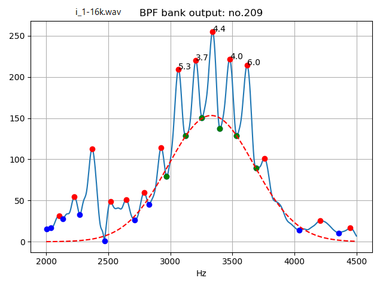
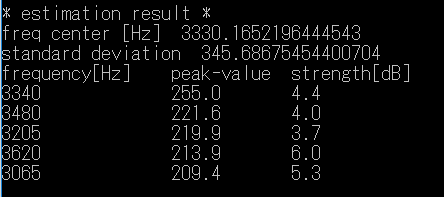
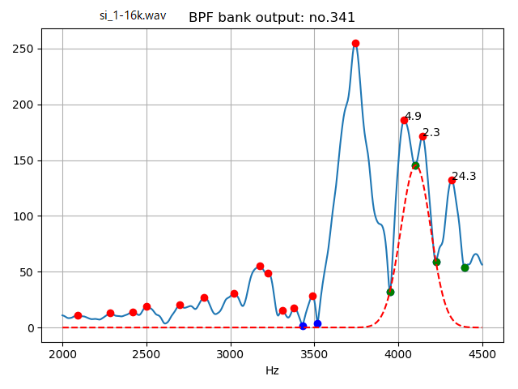
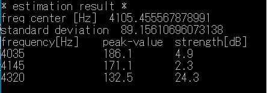

# Noise Spectrum Estimation   

A trial estimation of noise source spectrum condition by fitting Gaussian distribution on BPF bank output.  


[github repository](https://github.com/shun60s/Voice-BPF-bank/tree/master/Noise-Spectrum-Estimation/)  

## usage   

### preparation  
Compute band pass filter output.  
```
cd ../  
python3 main1.py -w wav-file-name(mono,16bit) -f frame-number -r result_figure  
```
Please see README.md of the top directory about usage.   
It will save BPF bank data, *bpf_env_out*.npz of the frame-number in the directory specified by argument -r.  
(-f negative value is not available)  

### estimation  
Get estimated Gaussian distribution, center frequency, standard deviation, and  peak strength.   

```
python3 est_nss1.py -r result_figure  
```
There is 1 argument.  
-r specify the directory of BPF bank data, *bpf_env_out*.npz.  
 
```
example:
    vowel /i/             : python3 est_nss1.py -r ../result_i  
    fricative voice /si/  : python3 est_nss1.py -r ../result_si  
```

  
  
  
  

## Document  


## License    
MIT  


