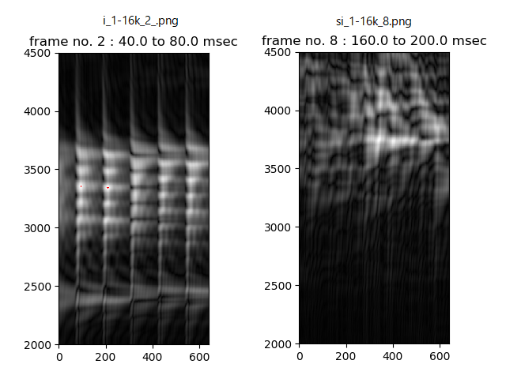
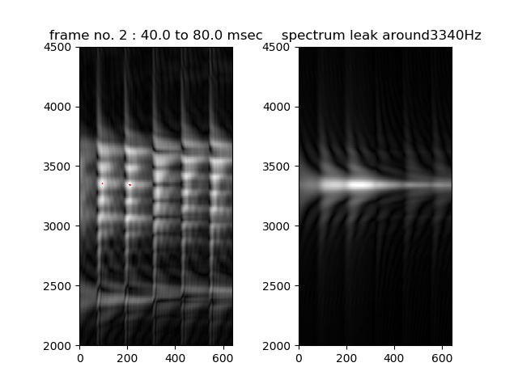

# Voice BPF bank   

Band Pass Filter bank and its application to voice sound analysis.  
Processing band pass filters of which center frequency is from 2000Hz to 4500Hz step by 5Hz and shows gray scale image as output.  

[github repository](https://github.com/shun60s/Voice-BPF-bank/)  

## usage   

```
python3 main1.py -w wav-file-name(mono,16bit) -f frame-number -r result_figure  
```
There are 5 arguments.  
-w specify input wav filename (mono,16bit)  
-f specify the frame number to analyze. if negative value, all frames (whole length) are analyzed.  
-r specify the directory name to save result image.  
--en   add this option to save result image instead of display.  
--leak add this option to see spectrum leak caused by the envelop. (not available with --en)  
Computed BPF bank output data will be save in  BPF_out.  

```
examples: all frames (whole length) analysis  
    vowel /i/            : python3 main1.py -w wav/i_1-16k.wav -f -1 -r result_i  
    fricative voice /si/ : python3 main1.py -w wav/si_1-16k.wav -f -1 -r result_si  
```

```
examples: specified frame analysis
    vowel /i/            : python3 main1.py -w wav/i_1-16k.wav -f 2  -r result_i  
    fricative voice /si/ : python3 main1.py -w wav/si_1-16k.wav -f 8  -r result_si  
```
  


```
examples: see spectrum leak caused by the envelop  
    vowel /i/            : python3 main1.py -w wav/i_1-16k.wav -f 2  --leak  
```
  


### resampling tool  

re-sampling wav to 16Khz sampling  
```
cd wav
python3 resample1.py -w wav-file-name(mono,16bit)  
```


## Application  

Please see subdirectory of Noise-Spectrum-Estimation to estimate noise source condition.  
And also, see subdirectory of Vocal-Tube-Estimation to estimate vocal tract condition.  


## Document  


## License    
MIT  


