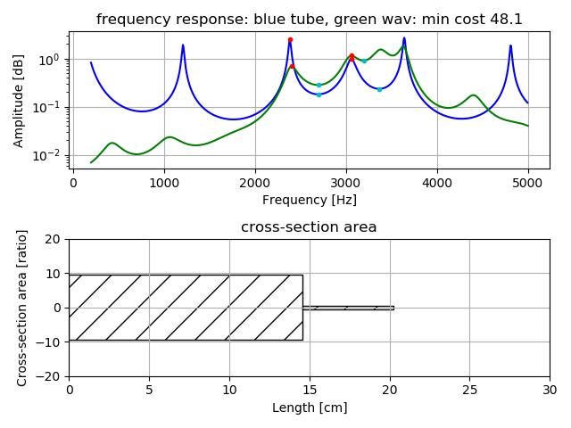

# Vocal Tube Estimation   

A trial estimation of vocal tract as very simple tube model, two tubes model, 
using several peak and drop-peak frequencies of vowel voice, by precomputed grid search and downhill simplex method,
with frequency limited condition.  

[github repository](https://github.com/shun60s/Voice-BPF-bank/Vocal-Tube-Estimation/)  

## usage    

### preparation   
make precomputed data for grid search to estimate two tubes model.  
```
python3 pre_compute1.py -l maxinum-tube-length -m minimum-frequency  
```
There are 2 arguments.  
-l specify maximum whole tube length[cm]  
-m specify detect minimum frequency [Hz]  
It will save pks_dpks_stack_tube2.npz.   

```
example: detect minimum frequency is from 2000Hz.  whole tube length is 10cm.  
    python3 pre_compute2.py -m 2000 -l 10  
```

Process high pass filter to reduce effect of pitch(F0) and F1.  
```
cd ../
python3 main1.py -w wav-file-name(mono,16bit)  
```
Please see README.md of the top directory about usage.  
It will save *hpf.wav in the same directory of wav-file-name.  


### estimation  
estimate vocal tract two tube model, under condition of higher frequency than the minimum frequency.  

```
python3 pks2tube2.py -w wav-file-name(mono,16bit) -f frame-number -r result_figure  
```
There are 3 arguments.  
-w specify input wav filename (mono,16bit) processed high pass filter  
-f specify the frame number to analyze. if negative value, all frames (whole length) are analyzed.  
-r specify the directory name to save result figure.  
Result will save as figure in the result_figure directory.  
Input wav format should be mono,16bit,16Khz.   
 
```
example: specified frame no.2 analysis  
    vowel /i/ : python3 pks2tube2.py -w ../wav/i_1-16k_hpf.wav  -r result_figure -f 2
```

  

### resampling tool

re-sampling wav to 16Khz sampling  
```
cd ../wav
python3 resample1.py -w wav-file-name(mono,16bit)  
```

## Document  


## License    
MIT  
except LPC.py  


